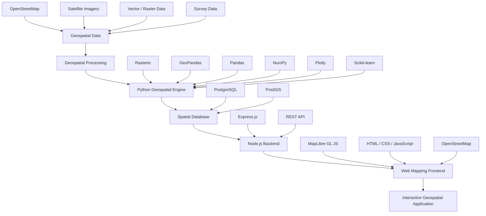

<h1 align="center">Halo, Saya Adnan Yusuf Hartawan 👋</h1>

<h3 align="center">
Mahasiswa Teknik Geodesi Universitas Diponegoro | GIS • Remote Sensing • WebGIS
</h3>

  
  
  

---

## 👤 Tentang Saya

Saya adalah mahasiswa **S1 Teknik Geodesi Universitas Diponegoro (UNDIP)** angkatan 2024 dengan ketertarikan pada **Geographic Information System (GIS), Remote Sensing, Geospatial Analysis, Photogrammetry, dan WebGIS**.

Saya tertarik mengembangkan workflow geospasial dari **data acquisition → spatial processing → analysis → visualization → web mapping**, dengan memanfaatkan teknologi open-source dan geospatial programming.

Saat ini saya juga terus mengembangkan kemampuan dalam **Python Geospatial, JavaScript, Web Mapping, Spatial Database, serta Backend API untuk aplikasi geospasial**.

* 🎓 S1 Teknik Geodesi — Universitas Diponegoro (2024–sekarang)
* 🌍 Fokus: GIS, Remote Sensing, Geospatial Analysis & WebGIS
* 🛰️ Remote Sensing & Earth Observation
* 📸 Photogrammetry & Surveying
* 🗺️ Web Mapping & Spatial Data Visualization
* 🗃️ Spatial Database & Geospatial Backend
* 🌐 Berkontribusi dan menggunakan data dari OpenStreetMap
* 📍 Kota Bekasi
* 📫 **Email:** [adnanyusufhartawan06@gmail.com](mailto:adnanyusufhartawan06@gmail.com)
* 💼 **LinkedIn:** https://www.linkedin.com/in/adnanyusufh/

---

## 💼 Pengalaman Kerja

### Magang — Kantor Pertanahan Kota Administrasi Jakarta Timur

**Januari 2026 — 1 Bulan**

* Terlibat dalam kegiatan survei dan pemetaan pertanahan.
* Membantu proses pengukuran bidang tanah di wilayah Kota Administrasi Jakarta Timur.
* Membantu pengukuran sebagai asisten surveyor pada kegiatan pengukuran bidang tanah di kawasan Ciracas, Jakarta Timur.
* Mendukung proses pengumpulan dan pengolahan data hasil pengukuran.

---

## 🚀 Proyek Geospasial

| No | Proyek                                                                                                                                                   | Teknologi                     | Deskripsi                                                                                         |
| -- | -------------------------------------------------------------------------------------------------------------------------------------------------------- | ----------------------------- | ------------------------------------------------------------------------------------------------- |
| 1  | [LandUse Classification Purwakarta City Using Machine Learning](https://github.com/shinmarizz/LandUse-ClassificationPurwakartaCity-UsingMachineLearning) | Python, Jupyter, Scikit-learn | Klasifikasi tutupan/penggunaan lahan Kota Purwakarta menggunakan pendekatan machine learning.     |
| 2  | [WebGIS LST Kota Bekasi](https://github.com/shinmarizz/landsurfacetemperature-bekasicity-gee)                                                            | JavaScript, GEE, WebGIS       | WebGIS interaktif untuk visualisasi Land Surface Temperature (LST) Kota Bekasi periode 2015–2025. |
| 3  | [LandCover Classification Serang District](https://github.com/shinmarizz/GEE-LandCover-Classification-SerangDistrict)                                    | GEE, JavaScript, CART         | Pemetaan tutupan lahan Kabupaten Serang menggunakan citra Landsat 8.                              |
| 4  | [Choropleth Map Bekasi City Python Based](https://github.com/shinmarizz/Chloropleth-Map-Bekasi-City-Python-based)                                        | Python, Pandas, GeoPandas     | Visualisasi data spasial dan statistik Kota Bekasi menggunakan peta choropleth.                   |
| 5  | [Change Detection Sukabumi](https://github.com/shinmarizz/Change-Detection-Deforestation-SukabumiCity-GEE)                                               | GEE, Python, Remote Sensing   | Analisis perubahan tutupan lahan untuk memantau deforestasi menggunakan data multi-temporal.      |
| 6  | [Mangrove Analysis Karawang](https://github.com/shinmarizz/ndvi-mvi-mangrove-gee-code-editor)                                                            | GEE, Python, NDVI, MVI        | Analisis indeks vegetasi untuk memantau kondisi ekosistem mangrove Kabupaten Karawang.            |

---

# 🧩 Geospatial Technology Stack

## 🖥️ Backend & API

  
  
  

---

## 🐍 Geospatial Processing & Data Analysis

  
  
  
  
  
  

---

## 🗺️ Web Mapping & Frontend

  
  
  
  
  

## 🗃️ Spatial Database & GIS Platform

  
  
  
  
  
  

---

# 🏗️ Geospatial Application Architecture

### 🔄 General Workflow

**Data → Processing → Spatial Analysis → Database → API → Web Mapping → Visualization**

Workflow ini memungkinkan data geospasial yang berasal dari raster, vector, OpenStreetMap, maupun data survei untuk diproses menggunakan Python, disimpan pada spatial database, kemudian disediakan melalui API dan divisualisasikan dalam aplikasi WebGIS.

---

# 🧠 Spatial Analysis

Beberapa analisis geospasial yang sedang dipelajari dan dikembangkan:

* 🟢 **Buffer Analysis**
* 🔵 **Proximity / Nearest Distance**
* 🟠 **Network Analysis**
* 🟣 **Isochrone Analysis**
* 🔴 **Heatmap / Spatial Density**
* 🟡 **Raster Analysis**
* 🛰️ **Remote Sensing Analysis**
* 🤖 **Machine Learning for Geospatial Data**
* 📊 **Spatial Data Visualization**

---

# 🎯 Fokus Minat di Bidang Geodesi

### 🛰️ Remote Sensing

Analisis citra satelit seperti Landsat dan Sentinel-2, termasuk:

* Land Use / Land Cover Classification
* Change Detection
* NDVI
* NBR
* dNBR
* Vegetation Analysis

### 🗺️ Geographic Information System

* Spatial Analysis
* WebGIS
* Spatial Database
* Geospatial Programming
* Spatial Data Visualization

### 📸 Fotogrametri

* UAV Photogrammetry
* Structure from Motion
* Image Processing
* Aerial Triangulation
* Orthomosaic

### 📐 Survei & Geodesi

* Terrestrial Surveying
* Engineering Survey
* Land Survey
* Spatial Measurement

---

# 📫 Connect With Me

  
  
  

---

  <i>
    Building geospatial solutions through GIS, Remote Sensing, Spatial Analysis, and Web Mapping.
  </i>

